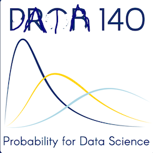

# Acknowledgements
#### Ani Adhikari, Spring 2022 ####

The development of Prob 140 has been a team effort by faculty and students.

Dibya Ghosh and Jason Zhang were central to course development, including course infrastructure, the prob140 Python library, the building and features of the interactive online textbook, computational and pedagogical aspects of several labs, quizzes, and overall pedagogy. They were also the Lead UGSIs (Undergraduate Student Instructors) in the initial offerings of the course. 

Max Weinstein completed the UGSI team in the pilot offering and worked on several labs. Kazu Kogachi and Mujahid Zaman were part of the course staff as tutors and UGSIs since it was first offered.

Discussion section structure and content owes much to Dibya Ghosh, Biyonka Liang, and Katherine Yen. Robert Sweeney Blanco and Shahzar Rizvi collated and improved the Chapter Exercises in the textbook.

All aspects of the class have been improved by the creativity and dedication of long-time Lead UGSI Alan Chuang.

The textbook was rebuilt in Summer 2018 by Dominic Croce based on infrastructure created by Chris Holdgraf. It was rebuilt again in Summer 2020 by Ryan Roggenkemper based on new Jupyter Books infrastructure created by Chris Holdgraf and others. 

The move to remote learning in 2020 was spearheaded by Alan Chuang, Katherine Yen, Anna Nguyen and Ryan Roggenkemper, and later also by Ophelia Wang, Rahul Jain, and Shahzar Rizvi. Rahul Jain included the videos in the textbook, while Huiyi Zhang and Xinran Liang helped develop the Quick Check exercises.

Prob 140 has always had outstandingly dedicated and creative staff teams. Apart from those mentioned above, the initial offerings were fortunate to have the contributions of Priyanka Bhoj, Arvind Iyengar, Serena Jiang, Tara Mirmira, Xinyi Ren, and Henry Zhu. 

### The Logo ###
The current logo was designed by Spring 2022 student Consuelo Ugarte, who accompanied the design with a fundamental truth gained from the class: "You can get really darn far with coinflips."

The original course logo by Biyonka Liang was the winning entry in a competition among students and staff in the pilot offering. Though formally Stat 140, the course was called Prob 140 as in Biyonka's logo.

In Spring 2021 the course officially became Data 140 and took its rightful place in the sequence Data [8](http://data8.org/), [100](http://www.ds100.org/), [140](http://prob140.org/), and [102](https://data102.org/). The logo was modified accordingly by the inimitable Ryan Roggenkemper, designer of some memorable staff swag. 

This one is destined to remain a classic. But Data 140 now has its own identity and hence also a new logo.